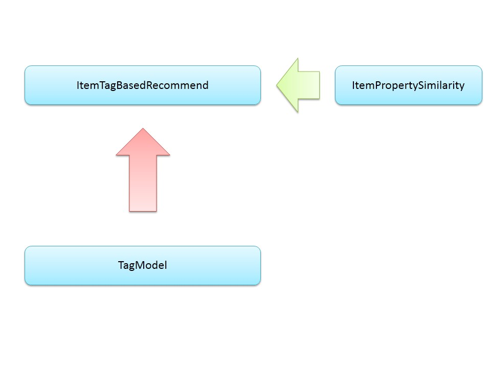

# Simple Recommender System
Simple User-based collaborative filtering recommender with itemTag-Based recommender and UserTag-based recommender included.

## Content
- Collaborative Filtering Recommender
    - referring to all user data
    - based on simialrities between users
- Content-Based Recommender
    - only referring to target user/item
    - based on user/item features(tags in this particular system)

## System Architecture

## Part I - Collaborative Filtering Recommender
This recommender uses (userID, ItemID, grade) data to do collaborative recommending.

Processes:
- Read in data and form the model
- Calculate the similarityMatrix using similarity factors(can be changed due to different requirements)
- Calculate the nearest neighborhood of the target user
- Recommend items according to these neighborhoods' favored items

Interfaces defined as follows:

## Part II - Content-Based Recommender
### 1/2 UserTag-Based Recommender
This recommender uses the target user's favorite items' features to predict the particular user's favored features, and then recommend items having these features.

Interfaces defined as follows:

### 2/2 ItemTag-Based Recommender
This recommender uses the target item's features(tags in this system) to find similar items sharing the highest similarities.

Interfaces defined as follows:

## Code Demo
Simple usages can be seen in file `./collaborativeFiltering/test.java`.
        